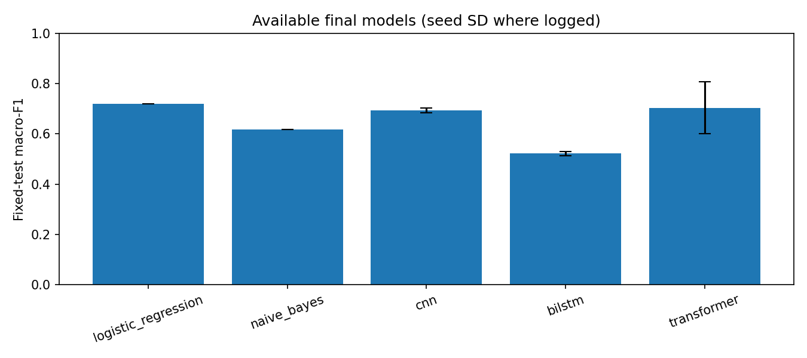
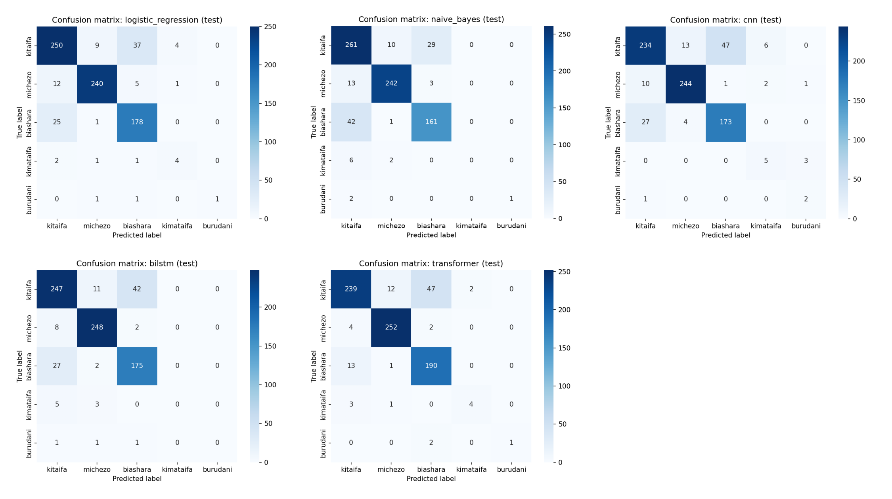

# Swahili News Classification with Sequential Models

ALU NLP and Language Technologies, Year 3 Trimester 2, Formative Assignment 2 (Group 13).

We compare five approaches for classifying Swahili news articles into five topics, using the [Zindi Swahili News Classification](https://zindi.world/competitions/swahili-news-classification-challenge/data) dataset, and ask:

> **How effectively can sequential modelling approaches classify Swahili news, and what evidence supports the strengths and limitations of the selected approaches?**

**Demo video:** [ADD LINK]

## Dataset

5,151 labelled news articles (5,148 after cleaning) in five categories, plus 1,288 unlabelled Zindi test articles.

| Category | Meaning | Articles |
|---|---|---|
| kitaifa | national | 2,000 |
| michezo | sports | 1,719 |
| biashara | business | 1,359 |
| kimataifa | international | 54 |
| burudani | entertainment | 16 |

The data is extremely imbalanced (125 to 1) and the articles are long (median 276 words). During exploratory analysis we also found that all 255 articles stored as Python lists were sports articles, a formatting shortcut that would have leaked the label; the cleaning step removes it.

## Results

Final scores on the held-out test set (773 articles). Baselines are deterministic, with their variability shown through cross-validation; neural models show the mean and standard deviation over three seeds.

| Model | Macro-F1 | Accuracy | Log loss | CV macro-F1 |
|---|---|---|---|---|
| TF-IDF + Logistic Regression | **0.719** | 0.871 | 0.465 | 0.633 ± 0.048 |
| TF-IDF + Naive Bayes | 0.618 | 0.860 | 0.654 | 0.533 ± 0.022 |
| 1D CNN | 0.694 ± 0.010 | 0.838 ± 0.012 | 0.458 ± 0.034 | not applicable |
| BiLSTM with attention | 0.522 ± 0.008 | 0.865 ± 0.012 | 0.404 ± 0.011 | not applicable |
| Fine-tuned AfroXLMR | 0.704 ± 0.104 | **0.899 ± 0.010** | **0.317 ± 0.008** | not applicable |





### Key findings

1. **Handling class imbalance mattered more than the architecture.** The three models trained with class weights have the highest macro-F1 (0.69 to 0.72), and their scores overlap once the transformer's seed spread is considered.
2. **Pretraining improved accuracy, calibration and the large classes, not the rare classes.** AfroXLMR has the best accuracy and log loss, but similar rare-class F1 to the weighted baselines.
3. **Word order added little for topic classification.** A character n-gram bag of words matched the transformer on macro-F1, because topics are mostly decided by keywords.
4. **The rare-class scores are unstable.** The test set has only 8 *kimataifa* and 3 *burudani* articles, and some test labels appear to be wrong.

## Notebooks

Run them in this order. Each notebook logs its experiments to `results/experiment_logs/` and saves its figures, misclassified examples and Zindi submission to `results/`.

| Notebook | Contents | Hardware |
|---|---|---|
| `01_eda.ipynb` | Data quality checks, class balance, article length, tokenizer comparison, vocabulary | CPU |
| `02_logistic_regression.ipynb` | Model 1: TF-IDF + Logistic Regression | CPU (about 30 minutes) |
| `03_naive_bayes.ipynb` | Model 2: TF-IDF + Naive Bayes | CPU |
| `04_cnn.ipynb` | Model 3: 1D CNN | GPU recommended |
| `05_bilstm.ipynb` | Model 4: BiLSTM with attention | GPU recommended |
| `06_transformer.ipynb` | Model 5: from-scratch transformer, AfriBERTa, XLM-R and AfroXLMR | GPU required (T4, about 2 hours) |
| `07_results_comparison.ipynb` | Five-model comparison tables and charts | CPU |

`00_model_template.ipynb` is the shared starting point each model notebook was built from.

## How to reproduce

### Google Colab (recommended)

1. Open a notebook from this repository in Colab (*File > Open notebook > GitHub*).
2. For notebooks 04 to 06, choose *Runtime > Change runtime type > T4 GPU*.
3. Run all cells. The first cell clones this repository and installs the requirements.

The transformer notebook backs up its results to Google Drive after every experiment, so a disconnected session can continue where it stopped.

### Locally

```bash
pip install -r requirements.txt
python -m src.data_cleaning
jupyter notebook
```

The cleaned splits are already included in `data/processed/`. Re-running `src.data_cleaning` recreates them exactly (fixed seed 42).

## Evaluation protocol

| Metric | Role |
|---|---|
| Macro-F1 | Main metric. Every class counts equally, so the rare classes matter (scikit-learn definition: mean of per-class F1) |
| Log loss | The Zindi competition metric; measures probability quality |
| Per-class F1 | Shows which classes each model struggles with |
| Accuracy | Reference only, since it hides the rare classes |

- All models use the same stratified 70 / 15 / 15 split (seed 42): trained on train, tuned on validation, and evaluated on test once.
- Baselines compare settings with repeated stratified 5-fold cross-validation (5 folds, 3 repeats).
- Neural models train their final settings with three seeds (42, 7 and 2026) and calibrate probabilities with temperature scaling.
- Every model was tested with balanced class weights.

| Split | kitaifa | michezo | biashara | kimataifa | burudani |
|---|---|---|---|---|---|
| Train | 1,400 | 1,203 | 951 | 38 | 11 |
| Validation | 300 | 258 | 204 | 8 | 2 |
| Test | 300 | 258 | 204 | 8 | 3 |

## Repository structure

```
data/
  raw/                     Original Zindi files
  processed/               Cleaned train, validation, test and Zindi test splits
notebooks/                 EDA, the five model notebooks and the results comparison
results/
  comparison/              Five-model tables, charts and confusion matrices
  experiment_logs/         One CSV per model, one row per experiment
  figures/                 Plots per model (confusion matrices, ROC curves, learning curves)
  misclassified/           Wrong test predictions per model, used in the error analysis
  submissions/             Zindi submission files
src/
  calibration.py           Temperature scaling for neural model probabilities
  config.py                Paths, labels, random seed and split sizes
  cross_validation.py      Repeated stratified 5-fold cross-validation
  data_cleaning.py         Cleans the raw text and creates the stratified splits
  data_loading.py          Loads the splits and converts labels to ids
  evaluation.py            Scores, misclassified examples and Zindi submissions
  experiment_log.py        Saves one row per experiment
  plots.py                 Confusion matrices, ROC curves and learning curves
  reproducibility.py       Random seeds for the final runs
  transformer_training.py  Tokenising, training and prediction for the transformer
```

## Team

| Member | Contribution |
|---|---|
| Michael Nwuju | Data cleaning, EDA, shared code, research, fine-tuned transformer, report |
| Alain Ngabo | 1D CNN and BiLSTM with attention |
| Vestine Umukundwa | TF-IDF + Logistic Regression |
| Samuel Rurangamirwa | TF-IDF + Naive Bayes and the results comparison |

## Data source

David, D. (2020). *Swahili: News classification dataset* (Version 0.1) [Data set]. Zenodo. https://doi.org/10.5281/zenodo.4300294, as distributed through the Zindi Swahili News Classification Challenge.
